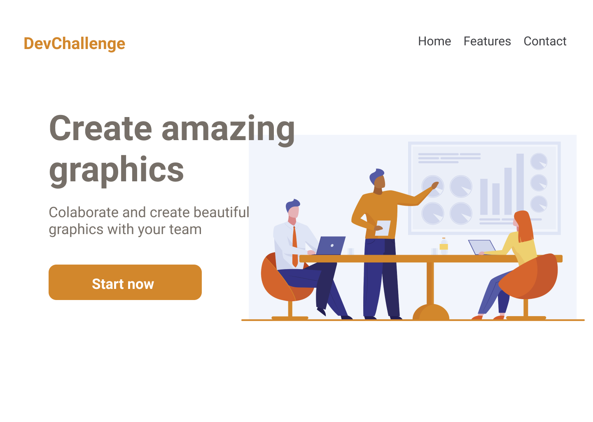

# AmazingGraph
 

<h4 align="center">
	🚧 1.0 🚀 em construção / limpar e corrigir 🚧
</h4>

<h1 align="center">
    
</h1>
  

# Challenge
Your challenge is to build a landing page about a website that create graphics.  
Seu desafio é criar uma página sobre um site de criação de gráficos.

# Techs: 
HTML 
CSS

# Getting start:
1 - Use this template or download this repository with the starter code 
2 - Read the instructions in readme.md 
3 - Start coding! 
4 - Share your results with the community :) 
 
1 - Use esse template ou baixe esse repositório com o código inicial 
2 - Leia as instruções no readme.md 
3 - Comece a codar! 
4 - Compartilhe seu resultado com a comunidade :) 

# Requirements:
- Your page should get it looking as close to the design as possible 
- Your page should be responsive 
 

- Sua página deve se parecer o mais próximo possível do design 
- Sua página deve ser responsiva 

Feel free to use any workflow you are comfortable with :)

# Colors:
Orange: #D2872C 
Gray: #766F68

# Design:
Design available in `./design` path 
Images available in `./assets` path 
 
Modelo disponível na pasta `./design` 
Imagens disponíveis na pasta `./assets` 

# Font family:
- Roboto

# Share!

Designed and created by  <a href="https://github.com/Lorenalgm">Lorena</a> :)